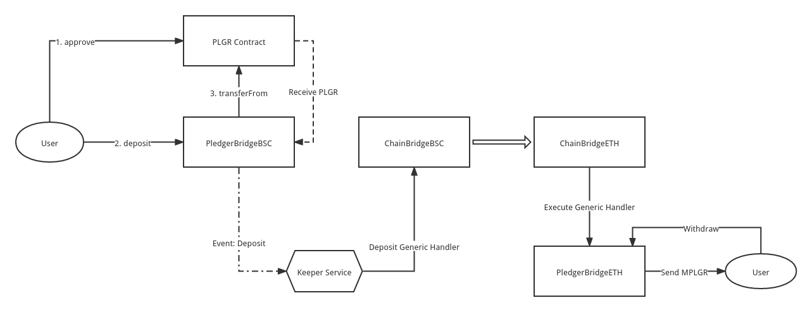
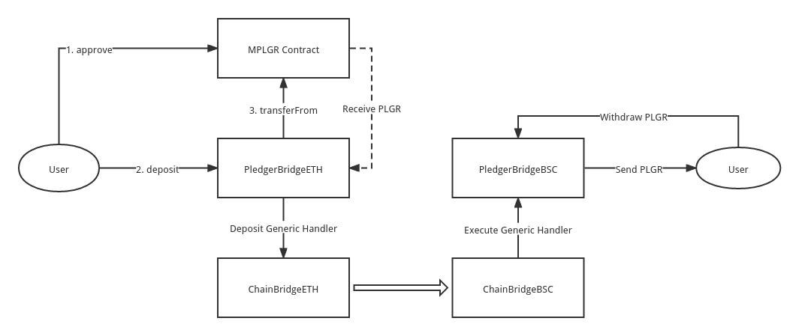

# pledger-bridge-contracts

## How To Deploy
```shell 
npm install
truffle compile
```

## Contracts
BSC <> ETH(reposten)

```shell
PLGR contract address : 0x22E6f32805d2AC7F787ca72b2F0bdbCE1693573b
MPLGR contract address: 0xb7d51b050f2072C2855B21579bB61955Cb484a97

PledgerBridgeBSC contract address : 0xac146f0BfecE6C48e4ac65BbcE687A6c3cC10878
PledgerBridgeETH contract address : 0xF0e45b173953705AfA3C4431050F892432C3fE90
```

### PLGR -> MPLGR



### MPLGR -> PLGR



